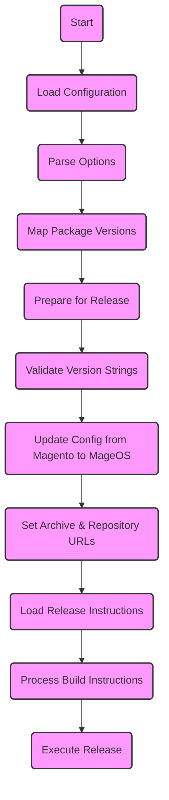

# Mage-OS Composer Repository Generator

## Background

This project was started not with the primary goal to go into production, but rather to explore and learn how to build Magento Open Source releases.  
It has evolved to be used in production. However, the intention is to create additional implementations, for example in Rust <https://github.com/mage-os/package-splitter>.  

## Generated composer repositories

The generator is used to generate the following composer repositories:

- https://mirror.mage-os.org
- https://upstream-nightly.mage-os.org
- https://repo.mage-os.org

It can also be used to generate custom mirrors and releases based on Mage-OS.

## Versions generated for mirrors

When generating a mirror composer repository, all packages required to install Magento Open Source 2.3.7-p3 and newer will be created.
This might change in the future.

## Usage

This project provides a docker image to generate a composer package repository.  

Mount the directory to contain the generated files into `/build` while executing the image.  
Usually this will be the DOCUMENT_ROOT of the host serving the composer repo, for example `--volume /var/www/html:/build`.  

### Specifying the build target(s)

This project can generate different types of composer repositories. At the time of writing, the supported build targets are

#### `--target=mirror` (default)

By default, a Magento Open Source mirror repository is generated.

#### `--target=upstream-nightly`

This generates a release of the current development versions of Magento Open Source. This is known as an "upstream nightly" build.

#### `--target=mageos-nightly`

This generates a release of the current development versions of Mage-OS. This is known as a "nightly" build.

#### `--target=release`

This build target requires a number of additional arguments:
* `--mageosRelease=x.x.x` The release version, for example 1.0.0
* `--mageosVendor=mage-os` The composer vendor name for the release. Defaults to `mage-os` 
* `--upstreamRelease=2.4.6-p1` The corresponding Magento Open Source release.


### Caching git repositories

Caching git repos is optional. Without caching, every git repository will be cloned each time the repo is generated. This ensures the latest versions will be used to generate the packages.  
However, cloning large repositories like Magento Open Source takes some time, so it can be beneficial to cache the cloned repository.  

A local directory can be mounted at `/generate-repo/repositories` in order to cache the cloned GitHub repos.  
Be aware that existing git repositories currently will not be updated on subsequent runs. This is mainly useful during development when executing the container image multiple times consecutively.
If you want to update a cached git repo before packages are generated, either delete the cache dir, or run `git fetch --tags` manually before executing the image. 

Example: `--volume "${HOME}/repo-cache:/generate-repo/repositories"`

### Mounting a composer dir

A `~/.composer` directory can be mounted, too, which will allow satis to benefit from existing caches. This doesn't make a big difference though.  
Example: `--volume "${COMPOSER_HOME:-$HOME/.composer}:/composer"`

### Example with docker

To generate the repository in the directory `~/html`, run the following command, replacing `https://mirror.mage-os.org` with the URL of your mirror:

```bash
docker run --rm --init -it --user $(id -u):$(id -g) \
  --volume "$(pwd)/html:/build" \
  --volume "${COMPOSER_HOME:-$HOME/.composer}:/composer" \
  magece/mageos-repo-js:latest  --target=mirror --mirror-base-url=https://mirror.mage-os.org
```

### podman

If you prefer to execute the container with `podman`, you should not specify the `--user` argument, as the in-container root user will automatically map to the current system user.
To generate the repository in `~/html` using podman, run the following command, replacing `https://mirror.mage-os.org` with the URL of your mirror:

```bash
podman run --rm --init -it \
  --volume "$(pwd)/html:/build:z"  \
  --volume "${COMPOSER_HOME:-$HOME/.composer}:/composer:z" \
  magece/mageos-repo-js:latest --mirror-base-url=https://mirror.mage-os.org
```

### Manual generation

It is possible to generate the composer repositories without a container.  
This process can be useful for automation, for example the mage-os composer repositories are built in this way via GitHub actions.  

For this, you'll need nodejs 16, php8-0 (or 7.4), yarn, git and composer.

Also, the [github.com/mage-os/php-dependency-list](https://github.com/mage-os/php-dependency-list) phar executable is expected to be in the PATH.

```sh
curl -L https://github.com/mage-os/php-dependency-list/raw/main/php-classes.phar -o /usr/local/bin/php-classes.phar
chmod +x /usr/local/bin/php-classes.phar
```

Check the corresponding workflows in `.github/workflows` for details on how to run the generation.

## Generating custom releases based on Mage-OS

Currently, the manual generation approach needs to be used to create custom releases.  
Two things are required:

* Specify a custom vendor name using the `--mageosVendor=extreme-commerce` option
* Provide custom meta-package dependency templates in `resource/composer-templates/{vendor-name}/`  
  See the existing ones in `resource/composer-templates/mage-os` for examples.  
  In future it will be possible to specify the composer-templates path with a command line argument.


## Building the docker image

```bash
docker build -t magece/mirror-repo-js .
```

---

## Internal Mage-OS Mirror Build

This steps describe how the Mage-OS Mirror can be updated.

1. Get latest versions of composer.json files: https://github.com/mage-os/magento2-base-composer-json
2. magento-os-package-splitter-js
    1. Update ressource/history/magento
        1. magento2-base
        2. product-community-edition
        3. project-community-edition (don't forget this. If the file is missing there is a template which sometimes let the build succeed. It should always be updated.)
    2. Add a json file for each new version
    3. Add the modified (not core packages) to the json file
    4. Add ZIP files which are not available as source in Github: node src/make-mirror-js --output=output/mirror (Packages are then commited into the repository)
3. Test local mirror: https://gist.github.com/Vinai/c411ddaa61c6c77f7086d7b16795d27a
4. Create Merge Request
5. Login as CI User
6. Add new versions to the Supported Version Matrix of the Github Action
    1. individual.json
        1. Change release and eol dates
    2. Run Tests
    3. npm build
7. Manually run Github Action: Test mirror build (Integrity)
8. Manually run Github Action: Installation Test
9. Run Integration Test from Infrastructure Repository
10. Merge changes to main branch to release
11. Manually run workflow to update satis

---

## Create a new Mage-OS Release

1. src/make/mageos-release.js
    Example: `node --outputDir=output/mageos-release/packages --mageosVendor=mage-os --mageosRelease=1.0.2 --upstreamRelease=2.4.6-p4`

    - All package get the same release number.
    - ``--upstreamRelease``: Takes packages of Magento Open Source (from Mage-OS Mirror). Used to define "Composer Package replace" version to prevent conflicts of external Magento module dependencies.
    - Steps
        - Requires packages-config.js
        - Clone all required repos
            - Replace all dependencies
 
Diagram:



## Copyright 2022 Vinai Kopp, Mage-OS

Distributed under the terms of the 3-Clause BSD Licence.
See the [LICENSE](LICENSE) file for more details.
